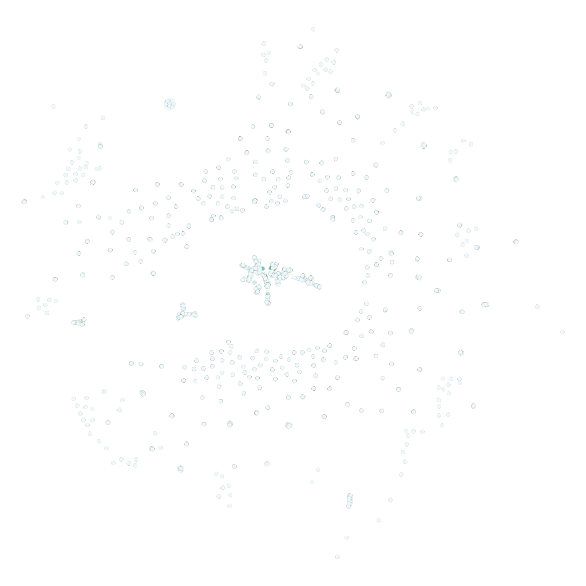
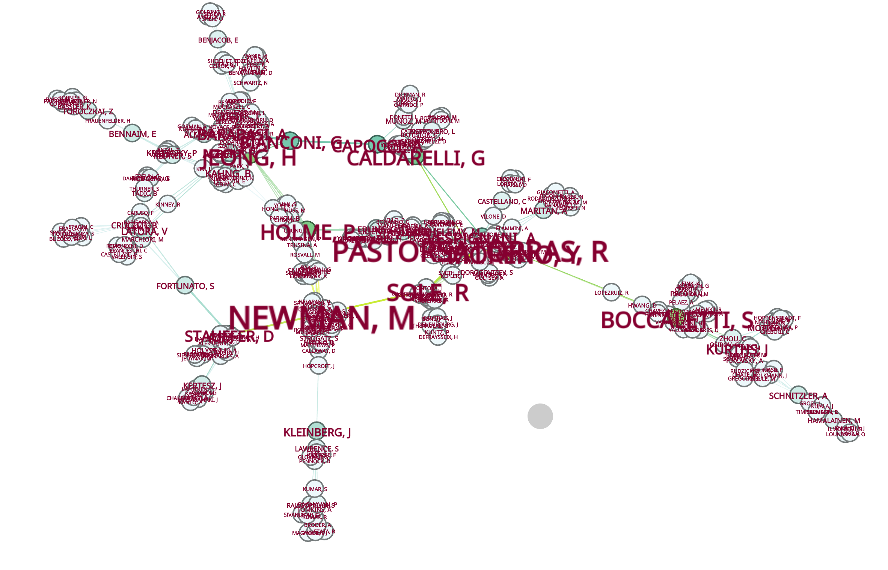

# ex3

## 3.1
I have chosen the following dataset:

Coauthorships in network science: coauthorship network of scientists working on network theory and experiment, as compiled by M. Newman in May 2006. A figure depicting the largest component of this network can be found here. M. E. J. Newman, Phys. Rev. E 74, 036104 (2006).

The dataset can be found here: https://gephi.org/datasets/netscience.gml.zip

## 3.2 

## 3.3
Colorscheme where rate of green is set by betweeness centrality

## 3.4

As visible all there is a very large community (labeled with componentID 10). 

The component is also visible in the visual represntation of the graph in pink color.

The same name as seen on top of the list can also be seen in component 10. Here the labels text size is set by the betweeness centrality of a node.

As around 23% of all nodes correspond to component 10, whereas the next biggest component has only 4% of the nodes, the cluster is very important for the overall network.
Interestingly the entire network is less connected as one would expect for science work being done in the same field. However the network displays coauthorship and not citations. The citation network is probably a lot more connected.

## 3.5

