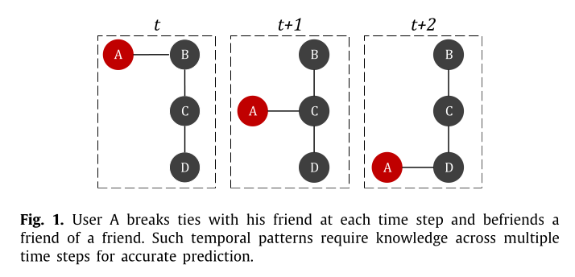

# Ex 02

Deep Learning is oftentimes used to generate embeddings for graphs, the embeddings however only capture the static structure and not the network dynamics. This paper primarily focuses on Link Prediction, where a model tries to predict future links based on past changes in the graph. 

For example:

Methods proposed in related work assume that patterns are of short duation (2 timesteps) and only use the previous timesteps to predict future links. Dynamics such as the one described in figure 1 cannot be captured by such a method.
