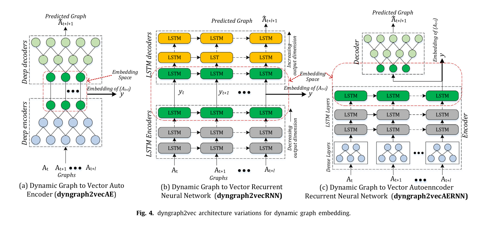
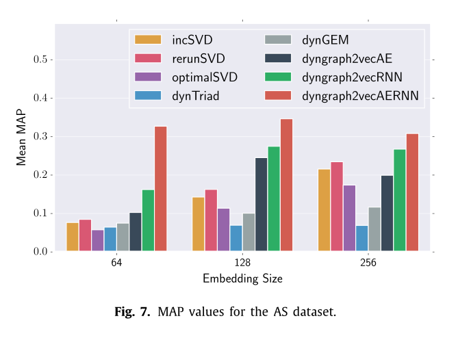

# Summary of *dyngraph2vec: Capturing network dynamics using dynamic graph representation learning*

**A paper by**: Palash Goyal, Sujit Rokka Chhetri, Arquimedes Canedo

---

This paper used graph embeddings computed by a neural network to make network link predictions.

Previous methods assumed short duration patterns with a maximum cycle of two timesteps and only use the previous timesteps to predict future links. Dynamics such as the one described in figure 1 cannot be captured by such a method.

A *graph embedding* aims to encode the entire graph as a vector in a relatively low dimensional space. This embedding can be used to make predictions for the graph and to compare graphs with others. Meaning two graphs with properties are embedded using vectors with a low distance between them. A *node embedding* does the same but instead of captuing information for an entire graph, it does so only for individual nodes. 
Static graph embeddings have been around for a while and many methods exist, where the embedding vectors primarily focus on preserving the strucutre of the graph. Methodologies to generate such vectors for a graph used to be based on traditional algorithms, whereas recent work oftentimes make use of deep autoencoders. A *
deep autoencoder* is a deep neural network, which generates a low dimensional vector representation of the input data, where the encoding should be reversible with as little information loss as possible.

There exists some research where the dynamics of a graph are captured using emnbeddings. This paper is however the first to propose graph embeddings as a mean to make dynamic link predictions. 

--- 

The authors propose three link prediction methods:

## Dyngraph2vecAE

As seen in figure 4 (a) this method is a naive extension to a basic auto encoder network. For static network emebeddings the input layer of the network has a size of N (number of nodes in the graph), as each network node is represented with a neuron in the graph. To ensure that the emebeddings capture the network dynamics as well, the input layer size is N times *l*, where *l* is the number of steps which should be captured by the embedding. This increase the number of paramaters by a factor *l*, which is substintantial. 

## dyngraph2vecRNN
This network (as seen in figure 4 (b)) uses LTSM (Long short-term memory) where neurons have feedback connections, which allow them to memorize inputs. For each timestep a array of LTSM's sequentially processes the input graph, where each LSTM also processes inputs from LSTM's processing graphs from different timesteps. The number of neurons in the overall NN is not smaller, however the number of paramters are, since each LSTM is fully conncted within its own layers but the rest of the network is not.

## dyngraph2vecAERNN

The final approach (as seen in figure 4 (c)) is a combination between the previous two approaches, where initially the model of a deep autoencoder is leveraged to reduce the required dimensions of the model. Whereas in the previous models the decoding part was esseentiallya mirrored version of the encoder, in this case the decoder does not have any LTSM models but only a Autodecoder architecture. 

The performance of the model was evaluated using the mean average precision (MAP), which is essentially the fraction of correct predictions over all predictions. The model was compared against other "state of the art" dynamic and static node embedding models: incSVD, rerunSVD, optimalSVD, dynTriad and dynGEM. All are designed to capture graph dynamics with embeddings, however they are not designed and trained for link prediction. The methods where evaluated on three real world network datasets and as seen in figure 7 the proposed method mostly outperformed the compared methods. 

The authors mention that in the future the methods could be tested on more datasets, hyper paratmeter tuning could be applied, other methods than link prediction could be used for evaluation. 

--- 

## Personal Remarks

I think the paper was not very well written and the models, which are essentially the core of everything are not described very precisely. Also the proposed models are compared in link prediction against models which are not specifically designed for link prediction but to capture other properties of dynamic networks. Even if the testing ground is not fair, the results are not that convincing, as the methods are not able to significantly outperform the competing models.